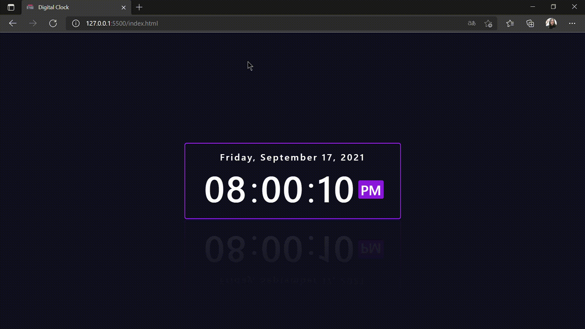

# Digital Clock ⏰

 <a href="#objetivo">Objetivo</a> • 
 <a href="#tecnologias">Tecnologias</a> • 
 <a href="#autora">Autora</a>

<h2 id="objetivo">Objetivo:</h2>

Criar um relógio digital com um design agradável e aplicabilidade no dia a dia de fato.  
O Design foi pensado para ser agradável aos olhos e interativo. Já a função adicionada de demostrar o dia da semana, mês e ano foi para dar uma funcionalidade a mais ao relógio digital, mas que não fosse apenas um relógio.
</>
<h2 id="tecnologias">Tecnologias:</h2>

Projeto feito com CSS3, HTML5 e JavaScript.

 

<h2 id="autora">Autora:</h2>

Camila C. R. Santos

  
